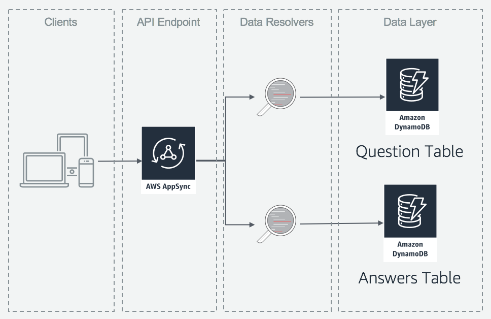
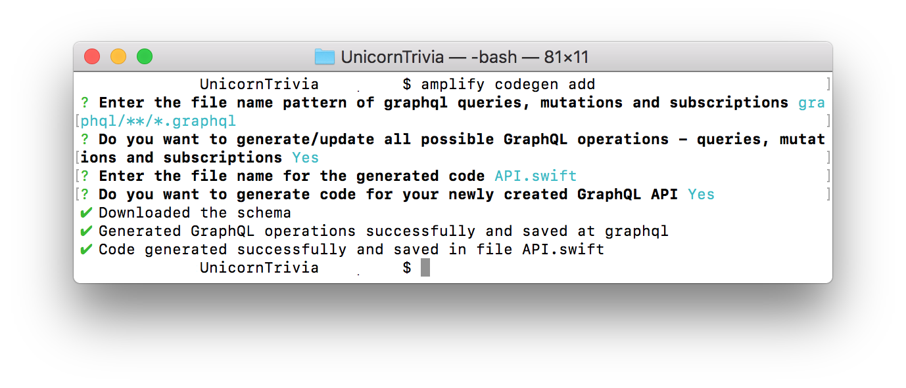

# Unicorn Trivia - React Native Mobile Client

## Troubleshooting Notes


1) if android sdk isnt installing. click file → invalidate cache and restart

## Step 0: Configuring your computer

Before doing this workshop, please install these required programs for the platform you will be running.

### IOS

1. Download and install Xcode from the [AppStore](http://appstore.com/mac/apple/xcode)
2. Download and install OBS from [obsproject.com](https://obsproject.com/download)

### Android

1. Install Node and Watchman using [Homebrew](http://brew.sh/)
2. Install Intel x86 Atom_64 System Image from the Android Studio SDK menu

Install Node and Watchman using Homebrew using the below commands:

1. brew install node
2. brew install watchman

Install the AWS amplify CLI with the node package manager(npm) using the following command:

1. npm install -g @aws-amplify/cli

## Step 1:  Android Studio Configuration

1. clone the project with git clone 
2. run export `JAVA_HOME=\`/usr/libexec/java_home -v 1.8\`` to get the right JDK version
3. Navigate to the root directory of the project
4. Run`npm install` to install dependencies detailed in package.json
5. Run `react-native link` to link the React Native modules libraries to the project.

## Step 2: AdminPanel Walkthrough
1. Open a terminal and navigate to your root directory of the AdminPanel.
1. Once you are in the adminpanel directory install the dependancies using `npm install` for the adminpanel 
1. Now to start the local deployment of the AdminPanel run the command `npm start`
    1. A tab should now automatically open in your default browser to `http://localhost:3000/`. You have now successfully deployed the administrator panel for UnicornTrivia!
    1. When you issue the command `npm start` from the root directory of your React project, NodeJS will look for a scripts object in your package.json file. If found, it will look for a script with the key start and run the command specified as its value. You can view which scripts will be run by taking a look into package.json and taking a look at the "scripts" object.
1. Now that you have the AdminPanel installed and running now it it is time to add in your API. Just like before when we setup the live-stream we will be using Amplify to setup the backend for the AdminPanel. So run `amplify api add` and use these values
    1. Please select from one of the below mentioned services: `GraphQL`
    1. Provide API name: `You Choose`
    1. Choose an authorization type for the API: `API key`
    1. Do you have an annotated GraphQL schema? `N`
    1. Do you want a guided schema creation? `Y`
    1. What best describes your project: `Single object with fields`
    1. Do you want to edit the schema now? `Y`
        1. This will open your default editor that you configured with a GraphQL model:
            ```graphql
            type Todo @model {
              id: ID!
              name: String!
              description: String
            }
            ```
        1. We will be changing the model to:
            ```graphql
            type Question @model {
                id: ID!
                question: String!
                answers: [String]!
                answerId: Int
            }

            type Answer @model {
                id: ID!
                username: String!
                answer: [Int]
            }
            ```
1. Now run `amplify push` to create the backend resources.
    1.  a. Y
    1. Y - Codegen time!
    1. javascript
    1. leave as default
    1. Y
    1. So what does the models you defined above create for you in the backend:
        
        Each one of these models will have a DynamoDB table associated with it and each will be connected to AppSync through Resolvers. Resolvers are how AWS AppSync translates GraphQL requests and fetches information from your AWS resources (in this case the DynamoDB table). Resolvers can also transform the information sent to and received from your AWS resources. We will dive deeper in a later section on this.
1. Time to add the ablity to push questions
1. Open the src/App.js file in your favorite text editor.
1. Add this code this code to the top of the file:
    ```javascript
     import {createQuestion, updateQuestion} from './graphql/mutations.js';
     import {onCreateQuestion} from './graphql/subscriptions.js';
     import aws_exports from './aws-exports';
    ```
1. Add this under all the imports:
    `Amplify.configure(aws_exports);`
    This gets the info from the aws-exports.js file and this will be updated as you update your backend resources using amplify.
1. Add this code to LOCATION1:
    ```javascript
    const question = {
        input: {
          question: rowData["Question"],
          answers: rowData["Answers"]
        }
      }
    API.graphql(graphqlOperation(createQuestion, question)).then(response => {
          rowData["id"] = response.data.createQuestion.id;
          console.log(response.data.createQuestion);
        });
    ```
    This creates a question from the table data in the format of input.
1. Add this code to LOCATION2:
    ```javascript
    const question = {
          input: {
            id: rowData["id"],
            answerId: rowData["Answer"]
          }
        }
    API.graphql(graphqlOperation(updateQuestion, question)).then(response => {
          console.log(response.data.updateQuestion)
        });
    ```
    Talk about how this is different then the createQuestion above. Mainly it requires the ID from the question so that we know which response we need to give.

1. `npm start` and observe we are now pushing questions in the console. We observe the object changing.

1. **Extra Credit** To view subscriptions you can add this at the top of your file:
    ```javascript
    const subscription = API.graphql(
        graphqlOperation(onCreateQuestion)
    ).subscribe({
        next: (eventData) => console.log('Subscribe:', eventData)
    });
    ```
1. Now copy your `amplify` folder from your `AdminPanel` folder that you created in our last section and place a copy in the root directory of the react native project.
1. Then run `amplify configure project`. This will allow Amplify to generate javascript code unique to your API endpoint.
    1. Keep all your values the same except change your type of app you are building from `react` to `react-native`. 
    1. When done it should looks something like this: 
    
1. Once you change the project configurations run `amplify codegen add`.
    1. Walkthrough the steps and use all the default parameters. It should looke something like this:
    
    1. When Codegen finishes you should have a `API.swift` file and a `awsconfiguration.json` file in the root of your project.
1. Now your project has been configured.

## Step 4: Building the Video Component

Now that our environment is all set up we are ready to begin implementing our application! React applications are broken up into “Components” or microservices within the application. Let's begin by creating the video player component! This component will display our stream output on the phone.

1. Navigate to ./src/components/App/Video/Component.js
2. First, we need to write the function definitions for setVideoDimensions() and the Render() function.
3.  Lets now take a look at the setVideoDimensions() function. Lets paste this code snippet into the function. Here we set the values for the Hight and Width of the player which will be visible on the screen in our react application.
```
this.setState({
        styles: {
            ...this.state.styles,
            height: this.state.dimensions.scale * this.state.dimensions.width,
            width: this.state.dimensions.scale * this.state.dimensions.height
        }
    });
```
5. The final step is to define the render function. This is the code that will draw our component on the screen. In this case the render function will place our video player over the entire area of the screen! Paste in this code into the render function. **REMEMBER TO REPLACE THE SOURCE URI WITH YOUR MEDIASTORE EGRESS URL!**
6.         return(
                <ReactNativeVideoPlayer
                    source={{uri: "INSERT_MEDIAPACKAGE_URL"}}
                    ref={(ref) => {
                        this.player = ref
                    }}
                    resizeMode={"stretch"}
                    muted={true}
                    style={{
                        minWidth: Dimensions.get('window').width + 200,
                        minHeight: Dimensions.get('window').height,
                        left: -100
                    }}
                />
            );

## Step 5: Subscribing to the GraphQL API back end

1. Creating/migrating the aws_exports file and also the API.js files
1. Navigate to ./src/components/App/Game/component.js
1. Now we are ready to implement our graphql subscriptions. We will be creating two listeners, one listening for new questions and one listening for updated questions.
1. Find the function named “listenForQuestions” and paste in the following code.
```
let self = this;
        API.graphql(
            graphqlOperation(gqlToString(OnCreateQuestion))
        ).subscribe({
            next: (data) => {
                self.setState({
                    question: data.value.data,
                    answerAvailable: false,
                    questionAvailable: true,
                    modalVisible: true
                });
        }
     })
```
Explain what the code does. So we do a subscribe to the mutation called onCreateQuestion then do something with state.

1. Find the function named “listenForAnswers” and paste in the following code.
```
let self = this;
    API.graphql(
        graphqlOperation(gqlToString(OnUpdateQuestion))
    ).subscribe({
        next: (data) => {
            setTimeout(() => {
                self.setState({
                    answer: data.value.data,
                    answerAvailable: true,
                    questionAvailable: false,
                    modalVisible: true
                });
            }, 1000);
        }
    })
 ```
3. We are now successfully subscribed to our GraphQL backend and our application is listening for new questions and questions being answered!

## Step 6: Populating the question/answer modal

Now that our stream is playing and our subscriptions are set up. The last thing to do is to create the modal which displays the question and choices when a messaged, housing a new question or answer, is received by our listeners.

1.  The first step is to create the view for when a new question is pushed. Paste the following function into in the game component below the large commented code block.

```
    question = () => {
        if(this.state.questionAvailable){
            setTimeout((() => {
                this.setState({
                    modalVisible: false,
                    questionAvailable: false,
                    buttonsDisabled: true,
                    selectedAnswerButton: null
                });
            }).bind(this), 10000);
            return(
                <View style={styles.questionContainer}>
                    <View style={styles.question}>
                        <View style={styles.questionTitleContainer}>
                            <Text style={styles.questionTitle}>{ this.state.question.onCreateQuestion.question }</Text>
                        </View>
                        <View style={styles.answerButtonContainer}>
                            { this.answerButtons() }
                        </View>
                    </View>
                </View>
            );
        }
    }
```

   3. We will then create a similar view. This time for when an answered question is returned to the user displaying the correct and incorrect answer choices. Implement this view by pasting in the following code.

```
    answer = () => {
        let self = this;
        if(this.state.answerAvailable){
            setTimeout((()=> {
                let gameOver = this.state.questionCount == 1 ? true : false;
                let wrongQuestions = this.state.answerChosen.answer !== this.state.answer.onUpdateQuestion.answers[this.state.answer.onUpdateQuestion.answerId] ? [...this.state.wrongQuestions, {question: this.state.answer, answer: this.state.answerChosen.answer}] : [...this.state.wrongQuestions];
                if(gameOver){
                    setTimeout(() => {
                        self.setState({
                            modalVisible: true,
                            modalBackground: "transparent"
                        }, () => {
                            console.log("final state: ", self.state);
                        })
                    }, 2000);
                }
                this.setState({
                    modalVisible: false,
                    answerAvailable: false,
                    buttonsDisabled: false,
                    wrongQuestions: wrongQuestions,
                    answerChosen: {},
                    selectedAnswerButton: null,
                    gameOver: gameOver,
                    winner: gameOver == true && wrongQuestions.length == 0 ? true : false,
                    loser: gameOver == true && wrongQuestions.length > 0 ? true : false
                });
            }).bind(this), 10000);
            return(
                <View style={styles.questionContainer}>
                    <View style={styles.question}>
                        <View style={styles.questionTitleContainer}>
                            <Text style={styles.questionTitle}>{ this.state.answer.onUpdateQuestion.question }</Text>
                        </View>
                        <View style={styles.answerButtonContainer}>
                            { this.answerButtons() }
                        </View>
                    </View>
                </View>
            );
        }
    }
```

   4. The last function we need to include is the function that changes our data model when an answer is chosen. Lets call this function answerChosen. Paste next to the other functions we defined previously.

```
    answerChosen = (index) => {
        this.setState({
            questionsAnswered: true,
            selectedAnswerButton: index,
            buttonsDisabled: true,
            answerChosen: {
                index: index,
                answer: this.state.question.onCreateQuestion.answers[index]
            },
            questionCount: this.state.questionCount + 1
        });
    }
```

**5. The last thing to do is define how all the components are laid out on the screen, as well as define the logic of what happens on button clicks. In order to do this, uncomment the large code block for our answerButtons function.**
^^^^^^ **NEEDS TO CHANGE**

## Step 6: Running the application!

**Android**

Now that we have implemented every section of the application! It is time to run the app in our emulator.

1. First we want to open up the root path of our project in Android Studio.
1. The next step is to create and launch an Android emulator. We will start by clicking the purple phone icon in the menu bar.

1. Next we will chose the create virtual device button

1. We need to choose a device compatible with older versions of the API. Lets choose a Nexus 5X device! Then select Next.

1. Finally we need the android API Level 27 system image. This should be Android Oreo. If you don't already have it installed go ahead and begin the download (remember to check your drive for available space as these downloads can be fairly large)
1. Now select next and finish to return back to the previous screen. You should see your newely created virtual device. From here choose the green 'Play' button to launch the emulator!

1. Wait for android to launch and the home screen to appear. Then return to the terminal and navigate back to the root directory of our application.
1. From here run the command `react-native run-android` to launch the application in the emulator

**IOS**

1. Return the terminal to the root directory of our project.
1. Run the command `react-native run-ios`
1. The Xcode emulator should now launch and run your application.

Congratulations! You have now successfully implemented a UnicornTrivia application on one of three suported platforms!

Below are some additional resources for further development! Feel free to skip on forward to the clean up section !


