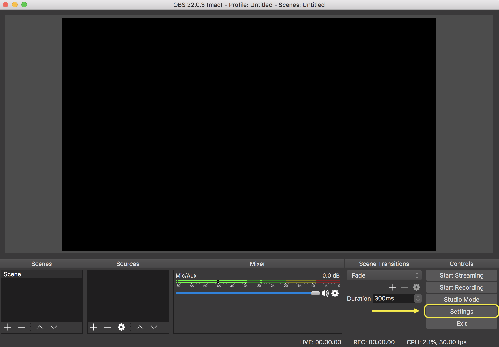
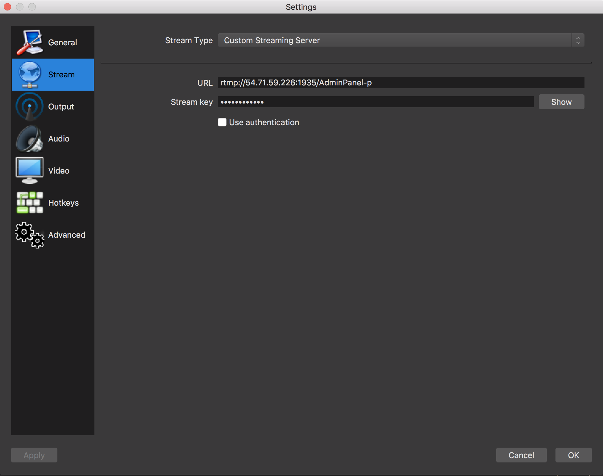
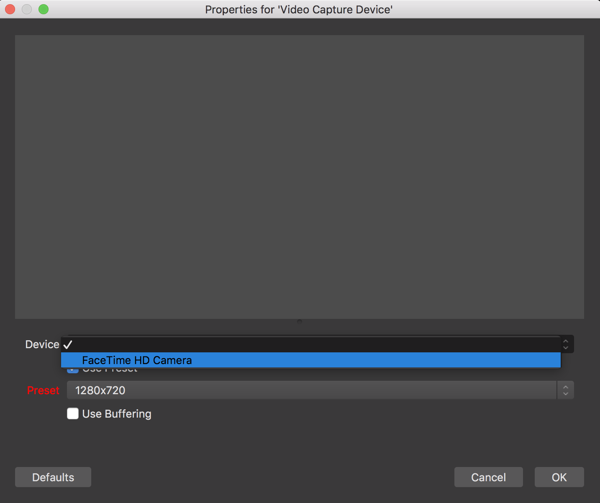

## AWS Amplify Unicorntrivia Workshop

This is repository contains a self-paced workshop that uses AWS AppSync, AWS Amplify and AWS Elemental Media Services to implement a live streaming trivia system.

## Live-Stream Walkthrough
1. First, open a terminal and navigate to your root directory of the AdminPanel.
1. Run `amplify init`. This command creates new AWS backend resources(in this case a single S3 bucket to host your cloudformation templates) and pull the AWS service configurations into the app!
1. Follow the prompts as shown in the below Image.
    1. If you do not have the AWS CLI installed and configured, amplify will direct you to create a default profile.
    
1. Now, add the amplify livestream module to the project using `amplify livestream add`
1. Again, follow the prompts as shown in the below image (remember to say no to the "Create Distribution" prompt!)
      
1. Once the prompts complete, make sure the module was added by checking `amplify status`
    
1. Now it is time to create our resources! Now run `amplify push` to create the backend resources for the livestream component! It will take a few minutes to stage and create the resources in your AWS environment.
1. Let's take a brief look at what was just created!

**Some explanation of what was created!!**
1. In order to retrieve the MediaLive endpoint that you just created, run the command `amplify livestream get-info` in the console.
1. Note down the  **MediaLive Primary Ingest URL, MediaLive Primary Stream Key, and the MediaPackage HLS Egress Url** 
    
1. Now Launch OBS. If you don't have it installed, refer to the "Configuring your computer" section for the download link.
1. Next, under the control tab in the bottom right hand corner, select "settings"

1. Choose "Stream" in the left hand panel

1. For "Stream Type", select "Custom Streaming Server"
1. In the "URL" field paste the **MediaLive Primary Ingest URL**
1. In the "Stream Key" field paste the **MediaLive Primary Stream Key**

1. Click OK to return to the main OBS panel.
1. The last step is adding an audio and video source. Under Sources on the bottom left hand side, select the **+** icon to add a source.
1. Choose Video Capture Device. Click the "Create New" radio button and provide a unique name and select ok.

1. In the next screen choose your video capturing device(most likely your laptop's built in web cam). Again, select ok.

1. Finally we need to add an audio source. Again choose the **+** icon in the sources pane. This time choose "Audio Input Capture".
1. Again, make sure the "Create New" radio button is selected and supply a name for the source and select ok. Under device, choose "Built in Microphone" and hit ok.
1. We are now ready to start the stream! Hit the "Start Streaming" button under the "Controls" panel in the bottom right hand side.
1. Check that the stream is up by pasting the MediaPackage HLS Egress Url into Safari or any supported HLS player.
    1. You can use the [JW Player Stream Tester](https://developer.jwplayer.com/tools/stream-tester/) if you don't have an HLS compatible player installed. Just paste your MediaStore output URL into the File URL Field on the page and click the red "Test Stream" Button. You should now see your channel playing in the Test Player.
    
1. Congratulations! You have now hosting a Live Stream Channel on AWS!

## License

This library is licensed under the Apache 2.0 License. 
