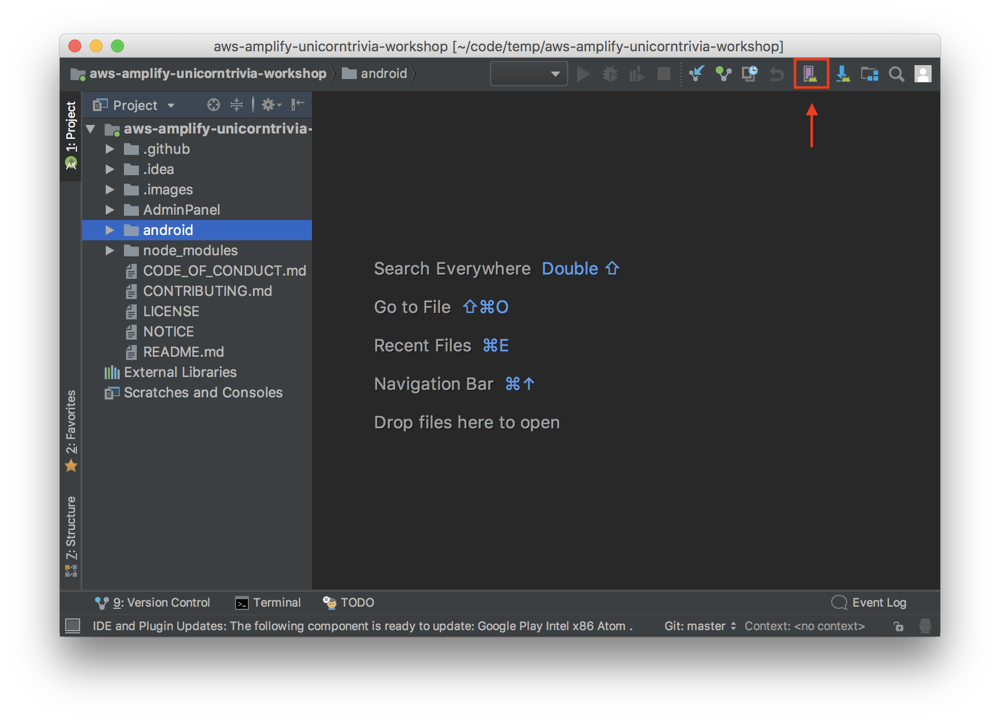

# Unicorn Trivia - React Native Mobile Client

## Troubleshooting Notes


1) if android sdk isnt installing. click file → invalidate cache and restart

## Step 0: Configuring your computer

Before doing this workshop, please install these required programs for the platform and operating system you will be running.

### Android && MACOS

1. Install Node and Watchman using [Homebrew](http://brew.sh/)
1. Install Intel x86 Atom_64 System Image from the Android Studio SDK menu

Install Node and Watchman using Homebrew using the below commands:

* `brew install node`
* `brew install watchman`

Install the react-native-cli with the node package manager(npm) using the following command:
* `npm install -g react-native-cli`

Install the AWS amplify CLI with the node package manager(npm) using the following command:
* `npm install -g @aws-amplify/cli`

### Android && Windows

You will need Node, the React Native command line interface, Python2, a JDKm and Android Studio. While you can use any ditor of your choice to develop your app, you will need to install Android Studio in order to set up the necessary tooling to build your React Native app for Android.

**Node, Python2, JDK**

We recomment installing Node and Python2 via Chocolatey, a popular package manager for Windwos.

React Native also requires a recent version of the Java SE Development Kit (JDK), as well as Python 2. Both can be installed using Chocolatey.

Open an Administrator Command Prompt (right click command prompt and select "Run as Administrator"), then run the following command: `choco install  -y nodejs.install python2 jdk8`

**The React Native CLI**

Install the CLI using `npm install -g react-native-cli`

## Step 1:  Android Studio Configuration

1. clone the project with git clone 
1. run `export JAVA_HOME='/usr/libexec/java_home -v 1.8'` to get the right JDK version. 
	1. If you are on windows, make sure your Java version is "1.8.0_192"
1. Navigate to the root directory of the project
1. Run`npm install` to install dependencies detailed in package.json
1. Run `react-native link` to link the React Native modules libraries to the project.

## Step 2: Building the Video Component

Now that our environment is all set up we are ready to begin implementing our application! React applications are broken up into “Components” or microservices within the application. Let's begin by creating the video player component! This component will display our stream output on the phone.

1. Navigate to ./src/components/App/Video/Component.js

1. The `Component.js` file houses the code which defines how we display our livestream on the client device. Let's take a deeper look at the functions in this file. 

First we have our Constructor which defines the internal data model. In this case we have variables which define the height and width of the player such that it fits the entire screen of the mobile device.
```
	constructor(props){
		super(props);
		this.state = {
			dimensions: Dimensions.get('window'),
			styles: {
				height: null,
				width: null
			}
		};
```
Furthermore, setVideoDimension function can be called to change the dimensions of the player by changing the internal data model defined above!

```
	setVideoDimensions = () => {
		this.setState({
			styles: {
				...this.state.styles,
				height: this.state.dimensions.scale * this.state.dimensions.width,
				width: this.state.dimensions.scale * this.state.dimensions.height
			}
		});
	}
```

1. Our goal for the Video Component is to define the render function that will draw our component on the screen. In this case the render function will place our video player over the entire area of the screen! We will connect the video player to our live streaming backend using the Medistore egress URL generated in the previous step. 


**REMEMBER TO REPLACE THE SOURCE URI WITH YOUR MEDIASTORE EGRESS URI!**
```javascript         
return(
                <ReactNativeVideoPlayer
                    source={{uri: "INSERT_MEDIASTORE_URL"}}
                    ref={(ref) => {
                        this.player = ref
                    }}
                    resizeMode={"stretch"}
                    muted={true}
                    style={{
                        minWidth: Dimensions.get('window').width + 200,
                        minHeight: Dimensions.get('window').height,
                        left: -100
                    }}
                />
            );
	    
```
## Step 3: Subscribing to the GraphQL API back end
In this section we will be subscribing our client to the back end GraphQL API hosted in AWS AppSync. ~~~

1. Our first goal is to pull in some of the files generated by amplify during our AdminPanel set up into the client branch that you chose to build. We will do this by copying files from the master branch to our client branch.
	1. Run `git branch`. Does the terminal output show that you are in the correct client workshop branch? In the following image you can see we should be in the unicorn-trivia-react-native-workshop branch. If you are in the wrong branch change branches using the command: `git checkout unicorn-trivia-react-native-workshop`
	1. Now we will copy the GraphQL files from the master branch's AdminPanel directoy. We can do this with a few easy commands!
	1. Start by running `git checkout master AdminPanel/src/graphql` and `mv AdminPanel/src/graphql src/`. We will now follow the same process for our aws_exports.json file.
	1. Run the commands `git checkout master AdminPanel/src/aws-exports.json` and `mc AdminPanel/src/aws-exports.json src/`
	1. **Great!** Now all of our files are copied! Let's begin implementing!
	
1. Navigate to ./src/components/App/Game/component.js
1. Now we are ready to implement our graphql subscriptions. We will be creating two listeners, one listening for new questions and one listening for updated questions.
1. Find the function named “listenForQuestions” and paste in the following code.
```
let self = this;
        API.graphql(
            graphqlOperation(gqlToString(OnCreateQuestion))
        ).subscribe({
            next: (data) => {
                self.setState({
                    question: data.value.data,
                    answerAvailable: false,
                    questionAvailable: true,
                    modalVisible: true
                });
        }
     })
```
**TODO MIGUEL**

**Explain what the code does**. So we do a subscribe to the mutation called onCreateQuestion then do something with state.

1. Find the function named “listenForAnswers” and paste in the following code.
```
let self = this;
    API.graphql(
        graphqlOperation(gqlToString(OnUpdateQuestion))
    ).subscribe({
        next: (data) => {
            setTimeout(() => {
                self.setState({
                    answer: data.value.data,
                    answerAvailable: true,
                    questionAvailable: false,
                    modalVisible: true
                });
            }, 1000);
        }
    })
 ```
3. We are now successfully subscribed to our GraphQL backend and our application is listening for new questions and questions being answered!

## Step 4: Populating the question/answer modal

Now that our stream is playing and our subscriptions are set up. The last thing to do is to create the modal which displays the question and choices when a messaged, housing a new question or answer, is received by our listeners.

1. The first step is to create the view for when a new question is pushed. Paste the following function into in the game component below the large commented code block.

```
    question = () => {
        if(this.state.questionAvailable){
            setTimeout((() => {
                this.setState({
                    modalVisible: false,
                    questionAvailable: false,
                    buttonsDisabled: true,
                    selectedAnswerButton: null
                });
            }).bind(this), 10000);
            return(
                <View style={styles.questionContainer}>
                    <View style={styles.question}>
                        <View style={styles.questionTitleContainer}>
                            <Text style={styles.questionTitle}>{ this.state.question.onCreateQuestion.question }</Text>
                        </View>
                        <View style={styles.answerButtonContainer}>
                            { this.answerButtons() }
                        </View>
                    </View>
                </View>
            );
        }
    }
```

1. We will then create a similar view. This time for when an answered question is returned to the user displaying the correct and incorrect answer choices. Implement this view by pasting in the following code.

```
    answer = () => {
        let self = this;
        if(this.state.answerAvailable){
            setTimeout((()=> {
                let gameOver = this.state.questionCount == 12 ? true : false;
                let wrongQuestions = this.state.answerChosen.answer !== this.state.answer.onUpdateQuestion.answers[this.state.answer.onUpdateQuestion.answerId] ? [...this.state.wrongQuestions, {question: this.state.answer, answer: this.state.answerChosen.answer}] : [...this.state.wrongQuestions];
                if(gameOver){
                    setTimeout(() => {
                        self.setState({
                            modalVisible: true,
                            modalBackground: "#FFFFFF"
                        }, () => {
                            console.log("final state: ", self.state);
                        })
                    }, 2000);
                }
                this.setState({
                    modalVisible: false,
                    answerAvailable: false,
                    buttonsDisabled: false,
                    wrongQuestions: wrongQuestions,
                    answerChosen: {},
                    selectedAnswerButton: null,
                    gameOver: gameOver,
                    winner: gameOver == true && wrongQuestions.length == 0 ? true : false,
                    loser: gameOver == true && wrongQuestions.length > 0 ? true : false
                });
            }).bind(this), 10000);
            return(
                <View style={styles.questionContainer}>
                    <View style={styles.question}>
                        <View style={styles.questionTitleContainer}>
                            <Text style={styles.questionTitle}>{ this.state.answer.onUpdateQuestion.question }</Text>
                        </View>
                        <View style={styles.answerButtonContainer}>
                            { this.answerButtons() }
                        </View>
                    </View>
                </View>
            );
        }
    }
```

   4. The last function we need to include is the function that changes our data model when an answer is chosen. Lets call this function answerChosen. Paste next to the other functions we defined previously.

```
    answerChosen = (index) => {
        this.setState({
            questionsAnswered: true,
            selectedAnswerButton: index,
            buttonsDisabled: true,
            answerChosen: {
                index: index,
                answer: this.state.question.onCreateQuestion.answers[index]
            },
            questionCount: this.state.questionCount + 1
        });
    }
```

**5. The last thing to do is define how all the components are laid out on the screen, as well as define the logic of what happens on button clicks. In order to do this, uncomment the large code block for our answerButtons function.**
^^^^^^ **NEEDS TO CHANGE**


### Step Five: Recording answers

# TODO MIGUEL


1. Still in the `ViewController.swift` file we need to now perfom a mutation to add an user to our database.
1. Add this code to `func setupUser(username: String)` to start creating users.
    ```swift
    appSyncClient?.perform(mutation: CreateAnswerMutation(input: CreateAnswerInput(username: username)), queue: DispatchQueue.main, optimisticUpdate: nil, conflictResolutionBlock: nil, resultHandler: { (result, error) in
        
        self.questionView.setupClient(appSyncClient: self.appSyncClient!, userID: (result?.data?.createAnswer?.id)!)

    })
    ```
    This code is very similiar to what we did in our AdminPanel code. We just created a new User for our AnswersTable.
1. Now navigate to `UnicornTrivia/QuestionView.swift` in Xcode.
1. Once again add `import AWSAppSync` to the top of the file.
1. We need to configure our client and variables again so under `private var showTimer: Bool!` paste in:
    ```swift
    private var graphqlClient : AWSAppSyncClient!
    private var yourID : GraphQLID!

    func setupClient(appSyncClient: AWSAppSyncClient, userID: GraphQLID){
        graphqlClient = appSyncClient
        yourID = userID
    }
    ```
    This will enable passing of the AppSync configuration and also the user id to the view.
1. Finally we now need to send the answer up to the cloud. To do this we need to add this code to `func sendAnswer()`
    ```swift
    graphqlClient?.perform(mutation: UpdateAnswerMutation(input: UpdateAnswerInput(id: yourID, answer: [yourAnswer])))
    ```
1. Now that we are pushing to the cloud we should check the backend table to observe our answers being saved, but only one answer is being saved in the array. This seems to be an error. We can fix this though through the AppSync console using a resolver.
1. Open the [AppSync Console](https://console.aws.amazon.com/appsync/home) and navigate to your AppSync endpoint.
1. Once you select your AppSync endpoint on the left side select Schema.
    
1. You now should see your schema that was auto generated for you from Amplify. On the right side you should see a section called Resolvers. Search for `Mutation` in the text box and then select the clickable link next to `updateAnswer(...):Answer`
    
1. You are now presented with a Request Mapping Template and a Response Mapping Template.
    1. We are going to change the Request Mapping Templateto do the appending of the array.
    1. Navigate to `#set( $expression = "SET" )` and look for this line:
        ```vtl
        #set( $expression = "$expression $entry.key = $entry.value" )
        ```
    1. Replace this line with:
        ```vtl
        #if ($util.matches($entry.key, "#answer"))
            #set( $expression = "$expression $entry.key = list_append(if_not_exists($entry.key, :empty_list), $entry.value)" )
            $util.qr($expValues.put(":empty_list", $util.dynamodb.toDynamoDB([])))
        #else
            #set( $expression = "$expression $entry.key = $entry.value" )
        #end
        ```
        This checks to see if the field being set is the answer array. If it is the array then it will append the value. We also do a check to see if the field exists and if it doesn't we create an empty array to append our first value to.
    1. Save the resolver in the top right corner.
1. Run the app again and now you should observe the answers are being correctly appended to the array.


## Step 5: Running the application!

Now that we have every section of the application implemented, it's time to run the app in our emulator.

1. First we want to open up the root path of our project in Android Studio.
1. The next step is to create and launch an Android emulator. We will start by clicking the purple phone icon in the menu bar.

1. Next we will chose the create virtual device button

1. We need to choose a device compatible with older versions of the API. Lets choose a Nexus 5X device! Then select Next.

1. Finally we need the android API Level 27 system image. This should be Android Oreo. If you don't already have it installed go ahead and begin the download (remember to check your drive for available space as these downloads can be fairly large)
1. Now select next and finish to return back to the previous screen. You should see your newely created virtual device. From here choose the green 'Play' button to launch the emulator!

1. Wait for android to launch and the home screen to appear. Then return to the terminal and navigate back to the root directory of our application.
1. From here run the command `react-native run-android` to launch the application in the emulator

**Congratulations!** You have now successfully implemented a UnicornTrivia application on one of three suported platforms! 
Now Try sending some questions and answers using the admin panel we configured previously.

If you closed the terminal window running the admin panel no problem! Just open a new terminal window and navigate to the admin panel root directory and run `npm start`. Your default browser should now open up the admin panel on localhost:3000!

Below are some additional resources for further development! Feel free to skip on forward to the clean up section !

