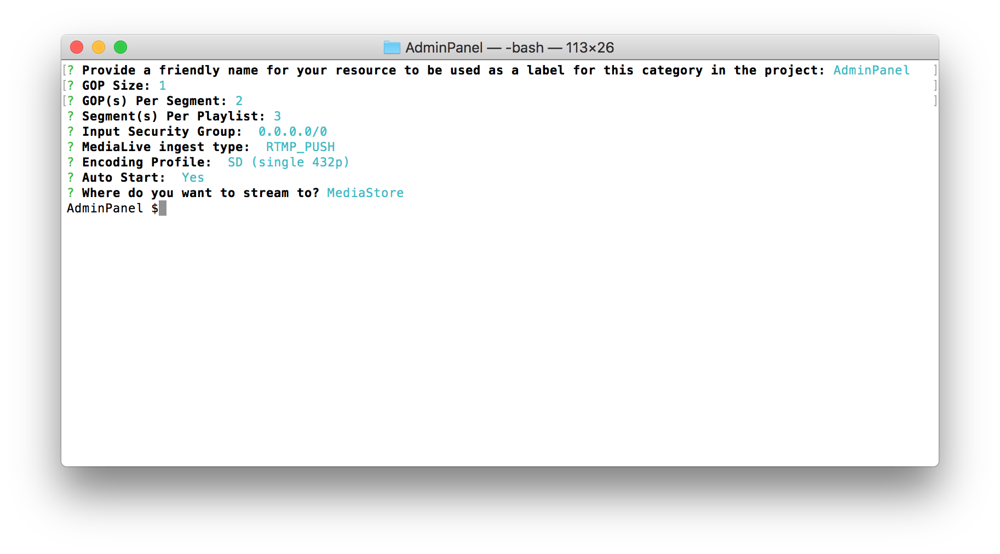

## AWS Amplify Unicorntrivia Workshop

This is repository contains a self-paced workshop that uses AWS AppSync, AWS Amplify and AWS Elemental Media Services to implement a live streaming trivia system.

### Configuring your computer.
Before doing this workshop please install these required programs


1. Download and install Xcode from the [AppStore](http://appstore.com/mac/apple/xcode)
1. Download and install OBS from [obsproject.com](https://obsproject.com/download)
1. Install Amplify CLI using this command `npm install -g @aws-amplify/cli`
1. Install Pods using this command `sudo gem install cocoapods`, if you have pods installed then run `pods update`
1. Clone the UnicornTrivia project repository using `git clone https://github.com/wizage/UnicornTriviaWorkshop.git` **This will change**
1. Intall the amplify livestream plugin `npm install -g <insert url>` or cd into `AmplifyElementalPlugin` and run `npm install -g`

## AdminPanel Walkthrough
1. Open a terminal and navigate to your root directory of the AdminPanel.
1. Once you are in the adminpanel directory install the dependancies using `npm install` for the adminpanel 
1. Now to start the local deployment of the AdminPanel run the command `npm start`
    1. A tab should now automatically open in your default browser to `http://localhost:3000/`. You have now successfully deployed the administrator panel for UnicornTrivia!
    1. When you issue the command `npm start` from the root directory of your React project, NodeJS will look for a scripts object in your package.json file. If found, it will look for a script with the key start and run the command specified as its value. You can view which scripts will be run by taking a look into package.json and taking a look at the "scripts" object.
1. Now that you have the AdminPanel installed and running now it it is time to add in your API. Just like before when we setup the live-stream we will be using Amplify to setup the backend for the AdminPanel. So run `amplify api add` and use these values
    1. Please select from one of the below mentioned services: `GraphQL`
    1. Provide API name: `You Choose`
    1. Choose an authorization type for the API: `API key`
    1. Do you have an annotated GraphQL schema? `N`
    1. Do you want a guided schema creation? `Y`
    1. What best describes your project: `Single object with fields`
    1. Do you want to edit the schema now? `Y`
        1. This will open your default editor that you configured with a GraphQL model:
            ```graphql
            type Todo @model {
              id: ID!
              name: String!
              description: String
            }
            ```
        1. We will be changing the model to:
            ```graphql
            type Question @model {
                id: ID!
                question: String!
                answers: [String]!
                answerId: Int
            }

            type Answer @model {
                id: ID!
                username: String!
                answer: [Int]
            }
            ```
1. Now run `amplify push` to create the backend resources.
    1.  a. Y
    1. Y - Codegen time!
    1. javascript
    1. leave as default
    1. Y
    1. So what does the models you defined above create for you in the backend:
        
        Each one of these models will have a DynamoDB table associated with it and each will be connected to AppSync through Resolvers. Resolvers are how AWS AppSync translates GraphQL requests and fetches information from your AWS resources (in this case the DynamoDB table). Resolvers can also transform the information sent to and received from your AWS resources. We will dive deeper in a later section on this.
1. Time to add the ablity to push questions
1. Open the src/App.js file in your favorite text editor.
1. Add this code this code to the top of the file:
    ```javascript
     import {createQuestion, updateQuestion} from './graphql/mutations.js';
     import {onCreateQuestion} from './graphql/subscriptions.js';
     import aws_exports from './aws-exports';
    ```
1. Add this under all the imports:
    `Amplify.configure(aws_exports);`
    This gets the info from the aws-exports.js file and this will be updated as you update your backend resources using amplify.
1. Add this code to LOCATION1:
    ```javascript
    const question = {
        input: {
          question: rowData["Question"],
          answers: rowData["Answers"]
        }
      }
    API.graphql(graphqlOperation(createQuestion, question)).then(response => {
          rowData["id"] = response.data.createQuestion.id;
          console.log(response.data.createQuestion);
        });
    ```
    This creates a question from the table data in the format of input.
1. Add this code to LOCATION2:
    ```javascript
    const question = {
          input: {
            id: rowData["id"],
            answerId: rowData["Answer"]
          }
        }
    API.graphql(graphqlOperation(updateQuestion, question)).then(response => {
          console.log(response.data.updateQuestion)
        });
    ```
    Talk about how this is different then the createQuestion above. Mainly it requires the ID from the question so that we know which response we need to give.

1. `npm start` and observe we are now pushing questions in the console. We observe the object changing.

1. **Extra Credit** To view subscriptions you can add this at the top of your file:
    ```javascript
    const subscription = API.graphql(
        graphqlOperation(onCreateQuestion)
    ).subscribe({
        next: (eventData) => console.log('Subscribe:', eventData)
    });
    ```
## Live-Stream Walkthrough
1. First, open a terminal and navigate to your root directory of the AdminPanel.
1. Run `amplify init`. This command creates new AWS backend resources(in this case a single S3 bucket to host your cloudformation templates) and pull the AWS service configurations into the app!
1. Follow the prompts as shown in the below Image.
    1. If you do not have the AWS CLI installed and configured, amplify will direct you to create a default profile.
    
1. Now, add the amplify livestream module to the project using `amplify livestream add`
1. Again, follow the prompts as shown in the below image (remember to say no to the "Create Distribution" prompt!)
      
1. Once the prompts complete, make sure the module was added by checking `amplify status`
    
1. Now it is time to create our resources! Now run `amplify push` to create the backend resources for the livestream component! It will take a few minutes to stage and create the resources in your AWS environment.
1. Let's take a brief look at what was just created!

**Some explanation of what was created!!**
1. In order to retrieve the MediaLive endpoint that you just created, run the command `amplify livestream get-info` in the console.
1. Note down the  **MediaLive Primary Ingest URL, MediaLive Primary Stream Key, and the MediaPackage HLS Egress Url** 
    
1. Now Launch OBS. If you don't have it installed, refer to the "Configuring your computer" section for the download link.
1. Next, under the control tab in the bottom right hand corner, select "settings"

1. Choose "Stream" in the left hand panel

1. For "Stream Type", select "Custom Streaming Server"
1. In the "URL" field paste the **MediaLive Primary Ingest URL**
1. In the "Stream Key" field paste the **MediaLive Primary Stream Key**

1. Click OK to return to the main OBS panel.
1. The last step is adding an audio and video source. Under Sources on the bottom left hand side, select the **+** icon to add a source.
1. Choose Video Capture Device. Click the "Create New" radio button and provide a unique name and select ok.

1. In the next screen choose your video capturing device(most likely your laptop's built in web cam). Again, select ok.

1. Finally we need to add an audio source. Again choose the **+** icon in the sources pane. This time choose "Audio Input Capture".
1. Again, make sure the "Create New" radio button is selected and supply a name for the source and select ok. Under device, choose "Built in Microphone" and hit ok.
1. We are now ready to start the stream! Hit the "Start Streaming" button under the "Controls" panel in the bottom right hand side.
1. Check that the stream is up by pasting the MediaPackage HLS Egress Url into Safari or any supported HLS player.
    1. You can use the [JW Player Stream Tester](https://developer.jwplayer.com/tools/stream-tester/) if you don't have an HLS compatible player installed. Just paste your MediaStore output URL into the File URL Field on the page and click the red "Test Stream" Button. You should now see your channel playing in the Test Player.
    
1. Congratulations! You have now hosting a Live Stream Channel on AWS!

## License

This library is licensed under the Apache 2.0 License. 
