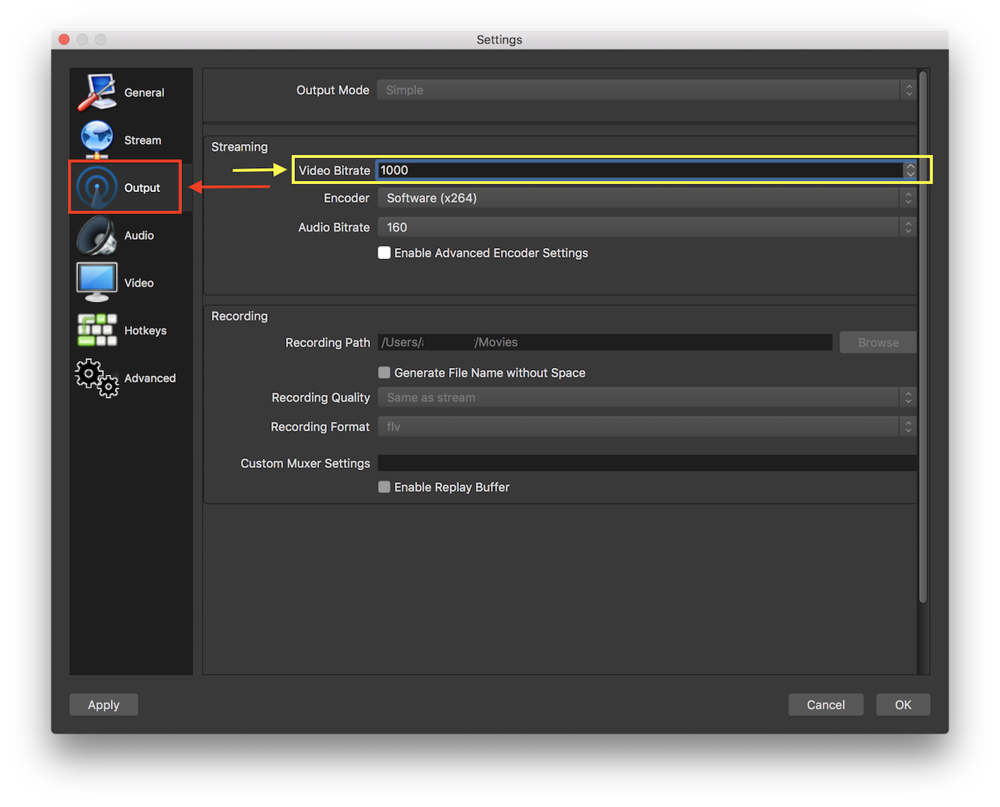

Welcome to UnicornTrivia, a self-paced workshop that uses AWS AppSync, AWS Amplify, and AWS Elemental Media Services to implement a live trivia app as a native mobile app and for web. This 300-level re:Invent 2018 workshop is designed for intermediate developers who are familiar with Amazon Web Services, mobile application development, and command-line tools.

UnicornTrivia is a Silicon Valley-based, stealth startup building the next big thing in entertainment - a live gameshow app where anyone can tune-in to compete for prize money by correctly answering trivia questions. You've just been hired as their lead developer and it's now your priority to ship a prototype of the app that they can use to pitch to investors. You've been given complete freedom to build the stack as long as you ship quickly and you've heard of a few new tools, like AWS Appsync, AWS Amplify, and AWS Elemental, that can remove a lot of the heavy lifting in building a mobile apps and video streaming services. This is your adventure in building UnicornTrivia's app.

This workshop is split into three sections outlined below. You will need to build the Live Streaming Service and Administrator Panel, but can choose which client(s) to implement.

**Live Streaming Service** - This service will encode and host a live video stream from a studio environment to the end users playing UnicornTrivia.

**Administrator Panel** - This allows a host to submit questions and collect answers from participants.

**Client** - This allows users to connect to the live stream and answer questions during the show using iOS, Android, and/or a web browser.

## Configure your development environment

You just started at UnicornTrivia and they hooked you up with a brand new laptop - _sweeeet!_ Now let's configure your development environment. 

1. Clone the UnicornTrivia project repository using `git clone https://github.com/awslabs/aws-amplify-unicorntrivia-workshop`
1. Download and install Node and Node Package Manager (NPM) if you don't already have it from [nodejs.org](https://nodejs.org/en/download/)
1. Install AWS Amplify CLI using this command `npm install -g @aws-amplify/cli`
1. Install a custom AWS Amplify CLI livestream plugin by moving into `AmplifyElementalPlugin` directory and running `npm install -g` or by running `npm install amplify-elemental-plugin -g`
1. Download and install Open Broadcaster Software (OBS) from [obsproject.com](https://obsproject.com/download)

## Live Streaming Service

We'll start by building a live streaming service that can receive a source signal from a studio, transcode the source into Adaptive BitRate (ABR), and serve the content to our application. ABR streaming protocols like Apple HTTP Live Streaming (HLS) and MPEG Dynamic Adaptive Streaming over HTTP (DASH) allow clients to access the live stream over any network connection and provide the best viewing experience to users. 

To encode a stream into ABR you need a real-time video encoder. There are many open-source and commercial options for real-time encoding, but many of them would require you to manage the deployment, scaling, and failover - _you're not interested in any of this_ - that's where AWS Elemental MediaLive comes in. MediaLive is a fully-managed AWS service that can process live media and create ABR protocols like HLS and DASH. MediaLive *does not* act as an origin to serve the streaming video, for that, we'll need another service.

For video files, S3 Static Hosting is a popular way to host video. In a live streaming scenario, however, it's not recommended to use S3 as a live streaming origin due to the way many ABR protocols work and the [S3 Data Consistency Model](https://docs.aws.amazon.com/AmazonS3/latest/dev/Introduction.html#overview). What other options do we have? AWS Elemental released two other services to help us with content origination - MediaPackage and MediaStore. The application is interactive, so we want to keep the latency from the studio to our end users under 10 seconds. You read a [comprehensive blog post](https://aws.amazon.com/blogs/media/how-to-compete-with-broadcast-latency-using-current-adaptive-bitrate-technologies-part-1/) from AWS on streaming latency and decided that for our use case, MediaStore is the best fit.

Now you need to deploy MediaLive and MediaStore. Sure, you could use the AWS Console or even Cloudformation, but you're in a hurry and not interested in writing YAML or JSON. You plan to use AWS Amplify CLI/SDK for the mobile app, maybe there's a way to manage your live streaming infrastructure with the same toolchain? Luckily, you met an Solutions Architect at the AWS SFO Summit who shared with you a [AWS Amplify plugin](https://aws-amplify.github.io/docs/cli/plugins) that does just this very thing. Let's get building!


1. First, open a terminal and navigate to your root directory of the AdminPanel.
1. Run `amplify init`. This command creates new AWS backend resources (in this case a single S3 bucket to host your cloudformation templates) and pull the AWS service configurations into the app!
1. Follow the prompts as shown in the below Image.
    1. If you do not have the AWS CLI installed and configured, amplify will direct you to create a default profile. 
    1. Note that because of the services leveraged, your AWS profile **MUST USE** us-west-2, us-east-1, eu-west-1, eu-central-1, ap-northeast-1, or ap-southeast-2.
    
1. Now, add the amplify livestream module to the project using `amplify livestream add`
1. Again, follow the prompts as shown in the image below
      
1. Once the prompts complete, make sure the module was added by checking `amplify status`
    
1. Now it is time to create our resources! Now run `amplify push` to create the backend resources for the livestream component! It will take a few minutes to stage and create the resources in your AWS environment. While that runs, let's take a brief look at what was just created! The Amplify CLI plugin created a MediaLive Channel which will process and deliver video segments to a MediaStore container (also created by the plugin). We'll serve the stream from MediaStore, but note that it is recommended to use a Content Delivery Network (CDN) like Amazon CloudFront. To begin processing video, you now need to send a source to the MediaLive endpoint.

1. In order to retrieve the MediaLive endpoint that you just created, run the command `amplify livestream get-info` in the console.
1. Note down the  **MediaLive Primary Ingest URL, MediaLive Primary Stream Key, and the MediaStore HLS Egress Url** 
    
1. Now Launch OBS. If you don't have it installed, refer to the "Configuring your computer" section for the download link.
1. Next, under the control tab in the bottom right hand corner, select "settings"

1. Choose "Stream" in the left hand panel

1. For "Stream Type", select "Custom Streaming Server"
1. In the "URL" field paste the **MediaLive Primary Ingest URL**
1. In the "Stream Key" field paste the **MediaLive Primary Stream Key**

1. Now we need to change the bitrate of our stream. Let's now choose output in the sidebar and change Video Bitrate to 1000.

1. Click OK to return to the main OBS panel.
1. The last step is adding an audio and video source. Under Sources on the bottom left hand side, select the **+** icon to add a source.
1. Choose Video Capture Device. Click the "Create New" radio button and provide a unique name and select ok.

1. In the next screen choose your video capturing device(most likely your laptop's built in web cam). Again, select ok.

1. Finally we need to add an audio source. Again choose the **+** icon in the sources pane. This time choose "Audio Input Capture".
1. Again, make sure the "Create New" radio button is selected and supply a name for the source and select ok. Under device, choose "Built in Microphone" and hit ok.
1. We are now ready to start the stream! Hit the "Start Streaming" button under the "Controls" panel in the bottom right hand side.
1. Check that the stream is up by pasting the MediaStore HLS Egress Url into Safari or any supported HLS player.
    1. You can use the [JW Player Stream Tester](https://developer.jwplayer.com/tools/stream-tester/) if you don't have an HLS compatible player installed. Just paste your MediaStore output URL into the File URL Field on the page and click the red "Test Stream" Button. You should now see your channel playing in the Test Player.
    

Congratulations! You have now hosting a Live Stream on AWS! Now let's setup the Administrator Panel that we will use to send trivia questions and collect answers from users watching our live stream.


## Administrator Panel

Our next step is to build an Administrator Panel which can be used to fire off API calls. This panel will be used by the host of the game to push questions and answers to the clients. In previous meetings, the UnicornTrivia dev team has settled on GraphQL to implement the api backend. Due to time to market being a critical business driver, we have decided on using a managed GraphQL service and due to its tight integration with AWS services, [AWS AppSync](https://aws.amazon.com/appsync/) will be the managed service of choice to serve our back end requests.

We will also be using the [AWS Amplify](https://aws-amplify.github.io/) library to effortlessly configure backends. We will be using the templating engine within [AWS Amplify](https://aws-amplify.github.io/) called CodeGen to quickly template the structure of our api and our live streaming infrastructure without hand writing any code! 

1. Open a terminal and navigate to your root directory of the AdminPanel.
1. Once you are in the adminpanel directory install the dependancies using `npm install` for the adminpanel 
1. Now to start the local deployment of the AdminPanel run the command `npm start`
    1. A tab should now automatically open in your default browser to `http://localhost:3000/`. You have now successfully deployed the administrator panel for UnicornTrivia!
    1. When you issue the command `npm start` from the root directory of your React project, NodeJS will look for a scripts object in your package.json file. If found, it will look for a script with the key start and run the command specified as its value. You can view which scripts will be run by taking a look into package.json and taking a look at the "scripts" object.
1. Now that you have the AdminPanel installed and running now it it is time to add in your API. Just like before when we setup the live stream you can use Amplify to setup the backend for the AdminPanel. Run `amplify api add` and use these values
    
    1. This will open your default editor with a default GraphQL model:
        ```graphql
        type Todo @model {
           id: ID!
           name: String!
           description: String
        }
        ```
    1. Change the model to:
       ```graphql
       type Question @model {
           id: ID!
           question: String!
           answers: [String]!
           answerId: Int
       }

       type Answer @model {
           id: ID!
           username: String!
           answer: [Int]
       }
       ```
    1. Save the file you just edited using your text editor.
1. Now run `amplify push` to create the backend resources.
    
        The models you defined above create the following on the backend:
        
        Each one of these models will have a DynamoDB table associated with it and each will be connected to AppSync through Resolvers. Resolvers are how AWS AppSync translates GraphQL requests and fetches information from your AWS resources (in this case the DynamoDB table). Resolvers can also transform the information sent to and received from your AWS resources. We will dive deeper in a later section on this.
1. Time to add the ablity to push questions. Open the src/App.js file in your favorite text editor.
1. Add this code this code to the top of the file:
    ```javascript
     import {createQuestion, updateQuestion} from './graphql/mutations.js';
     import {onCreateQuestion} from './graphql/subscriptions.js';
     import aws_exports from './aws-exports';
    ```
1. Under all the imports add the following:
    `Amplify.configure(aws_exports);`
    Amplify.configure() retrieves the configuration information from the aws-exports.js file it will be updated as you update your backend resources using Amplify.
1. Add this code to LOCATION1, this creates a question from the table data in the format of input:
    ```javascript
    const question = {
        input: {
          question: rowData["Question"],
          answers: rowData["Answers"]
        }
      }
    API.graphql(graphqlOperation(createQuestion, question)).then(response => {
          rowData["id"] = response.data.createQuestion.id;
          console.log(response.data.createQuestion);
        });
    ```
1. Add this code to LOCATION2:
    ```javascript
    const question = {
          input: {
            id: rowData["id"],
            answerId: rowData["Answer"]
          }
        }
    API.graphql(graphqlOperation(updateQuestion, question)).then(response => {
          console.log(response.data.updateQuestion)
        });
    ```
1. Run `npm start` and observe we are now pushing questions by opening the javascript debug console in your browser and clicking Post Question or Post Answer which is how we'll send trivia to our end-users.

## Continuing Onwards! **Extra Credit**

1. If you have some extra time, let's take a look at how to add our own questions. First, let's navigte to the AdminPanel root directory. From here we will move into the /AdminPanel/src/ directory and list the files inside. Inside, we should see a file named questions.json. This is the file that stores the questions, answer choices, as well as correct answer all wrapped within a JSON object. You can easily modify the questions by changing the structure of this file. Open it, modify questions.json with your own custom questions, and save! You have now added new questions that can be push to the subscribers of your app! If your AdminPanel is still running in the terminal, you should also see the questions auto update in the browser window!

1. To view subscriptions you can add this at the top of your file:
    ```javascript
    const subscription = API.graphql(
        graphqlOperation(onCreateQuestion)
    ).subscribe({
        next: (eventData) => console.log('Subscribe:', eventData)
    });
    ```

## Client

The final step in getting your prototype built is to create the clients. The clients will be able to subscribe to the questions and answers being sent from the Admin Panel as well as submit answers back. Since you don't want to write any extra code we will want to utilize Amplify's built in codegen funcionality. With the codegen you can easily update the clients without having to write a lot of extra code. On top of using Amplify's codegen you will also be using the Amplify SDK. This SDK does a lot of the heavy lifting for all of the apps including: authentication, graphql transformations and subscriptions, offline capabilities and much more. When it came to write the code we choose three different clients to develop for. We choose React, iOS and React-Native. The reason why we choose these three to go to market is because React and React-native can reach the most amount of users devices by default. iOS was choosen for native development due to the user base surounding the iOS App Store being very active.

Select which client your interested in building.

[Web](https://github.com/awslabs/aws-amplify-unicorntrivia-workshop/tree/unicorn-trivia-web-workshop) - Based on React

[iOS](https://github.com/awslabs/aws-amplify-unicorntrivia-workshop/tree/unicorn-trivia-ios-workshop) - Based on Swift, requires XCode and Cocoapods

[Android](https://github.com/awslabs/aws-amplify-unicorntrivia-workshop/tree/unicorn-trivia-react-native-workshop) - Based on React Native, requires Android Studio

## License

This library is licensed under the Apache 2.0 License.
