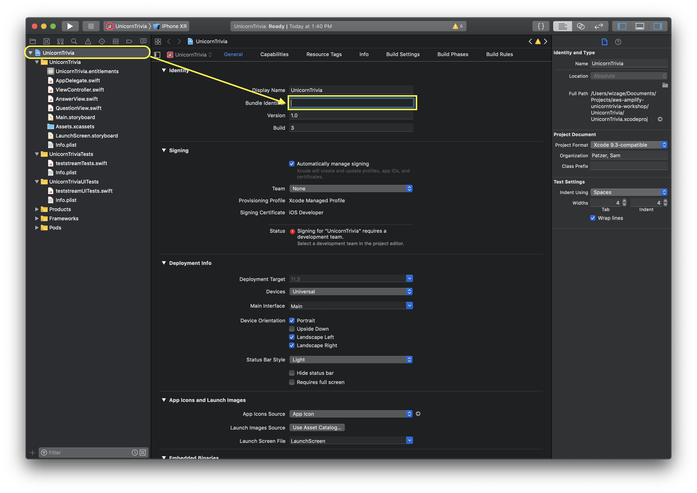

# Unicorn Trivia Workshop - iOS Version

### Configuring your computer.
Before doing this workshop please install these required programs

1. Download and install Xcode from the [AppStore](http://appstore.com/mac/apple/xcode)
1. Install Pods using this command `sudo gem install cocoapods`, if you have pods installed then run `pods update`
1. Download this zip file [here](https://github.com/awslabs/aws-amplify-unicorntrivia-workshop/archive/unicorn-trivia-ios-workshop.zip)

## iOS Walkthrough

### Step One: Configuring your Xcode Enviroment
1. Open a terminal and navigate to your root directory of the iOS app.
1. Run `pod install` to install required SDKs for the application.
1. Open the UnicornTrivia.xcworkspace that was generated
1. Navigate to the root of the project and change the bundle identifier to `yourname.unicorntriva` and make sure that the Team section is set to None. Should look something like this:
    
1. Copy your `amplify` folder from your `AdminPanel` folder that you created in our last section and place a copy in the root directory of the iOS project.
1. Then run `amplify configure project`. This will allow Amplify to generate iOS code unique to your API endpoint.
    1. Keep all your values the same except change your type of app you are building from `javascript` to `ios`. 
    1. When done it should looks something like this: 
    
1. Once you change the project configurations run `amplify codegen add`.
    1. Walkthrough the steps and use all the default parameters. It should looke something like this:
    
    1. When Codegen finishes you should have a `API.swift` file and a `awsconfiguration.json` file in the root of your project.
1. Back in Xcode, Navigate to `File->Add files to "Unicorn Trivia"`. Then select the `API.swift` and `awsconfiguration.json` files to add to your project.
1. Now your project has been configured.

### Step Two: Displaying your HLS Stream
1. If you lost your egress url from the `amplify livestream` setup then you can run `amplify livestream get-info` again to get the MediaStore url. It should look something like this: `url`
1. Navigate to UnicornTrivia/ViewController.swift in Xcode. Then, insert this code below in the `func playVideoEmbedded()` area and replace the `INSERT_URL_HERE` with your egress url:
    ```swift
    guard let url = URL(string: "INSERT_URL_HERE") else {
        return
    }
    self.addVideoPlayer(videoUrl: url, to: self.playerView)
    ```
    This code block setups up the URL that will be iOS native player called AVPlayer. AVPlayer plays HLS streams natively. To see how the AVPlayer is configured checkout out the function `addVideoPlayer` as it setups up the frame of the video player, sets the aspect ratio, and removes the controls from video.
1. Go head and run your project and observe you now have a running mobile app with your live-stream all setup.

### Step Three: Show Questions to the player
1. First we will need to setup our client to point to the correct GraphQL endpoint. So navigate to UnicornTrivia/AppDelegate.swift in Xcode.
1. At the top of the file we first need to import AppSync's SDK so copy and paste this line right under `import UIKit`
    ```swift
    import AWSAppSync
    ```
1. Next we need to create a AppSync client variable so that way we can use it throughout the application. Under `var window: UIWindow?` put `var appSyncClient:AWSAppSyncClient?`.
1. Now we get to configure the client variable. Find `func application(_ application: UIApplication, didFinishLaunchingWithOptions launchOptions: [UIApplication.LaunchOptionsKey: Any]?) -> Bool` and paste in this code:
    ```swift
    do {
        let appSyncConfig = try AWSAppSyncClientConfiguration(appSyncClientInfo: AWSAppSyncClientInfo())
        // initialize the AppSync client configuration configuration
        // initialize app sync client
        appSyncClient = try AWSAppSyncClient(appSyncConfig: appSyncConfig)
        
    } catch {
        print("Error initializing AppSync client. \(error)")
    }
    ```
    This code configures our AppSync client from the `awsconfiguration.json` file we copied into the project earlier.
1. Now that we have a configured AppSync client we need to now subscribe to our onQuestionsCreate that our AdminPanel is pushing out.
1. Navigate to UnicornTrivia/ViewController.swift in Xcode
1. Like before we need to copy `import AWSAppSync` to the top of the file.
1. Next we need to create some variables to store our AppSync subscription watchers and our AppSync Client for easy access. Copy these two lines right under `var player: AVPlayer!`
    ```swift
    var appSyncClient: AWSAppSyncClient?
    var newQuestionSubWatcher: AWSAppSyncSubscriptionWatcher<OnCreateQuestionSubscription>?
    ```
1. Now in `override func viewDidLoad()` copy in:
    ```swift
    let appDelegate = UIApplication.shared.delegate as! AppDelegate
    appSyncClient = appDelegate.appSyncClient
    ```
    This will make accessing the AppSync client we created earlier a lot easier.
1. Now navigate to `func startSubForQuestions()` and copy this in:
    ```swift
    let subscriptionRequest = OnCreateQuestionSubscription()
    do {
        newQuestionSubWatcher = try appSyncClient?.subscribe(subscription: subscriptionRequest, resultHandler: { (result, transaction, error) in
            let question = result?.data?.onCreateQuestion?.question
            let answers = result?.data?.onCreateQuestion?.answers as! [String]?
            if ((question != nil) && answers?.count == 3){
                self.questionView.updateView(question: question, answers:answers)
            } else {
                print("%@", error)
            }
            self.view.layoutIfNeeded()
            self.animateAfterQuestionReturn()
        })

    } catch {
        print("Subscribe error")
    }
    ```
    Breaking this down there are a few components that are good to know.
    1. `let subscriptionRequest = OnCreateQuestionSubscription()` creates a new request variable to our AppSync endpoint that includes what data should be returned. This function is defined in our generated code from `API.swift`
    1. `newQuestionSubWatcher = try appSyncClient?.subscribe` this line creates a new object called `Cancelable` this allows you to cancel your subscription anytime. This is an async call to our AppSync API endpoint to it will need a callback function to return the data to.
    1. The other lines in the callback function read through the data returned and cause an animation to be kicked off to show the question to the user.
1. Congrats. You now should be able to send trivia questions to your users. Please do note that you can only send one question before needing to restart the app. This is because we start the subscribe for anwers and cancel the sub

### Step Four: Show correct answers to the player
1. This is very similiar to what we did in the show Questions section of our app. Except instead of subscribing to `OnCreateQuestion` we instead subscribe to `OnUpdateQuestion`
1. Copy `var updateQuestionSubWatcher: AWSAppSyncSubscriptionWatcher<OnUpdateQuestionSubscription>?` right under our other subscription variable `var newQuestionSubWatcher`
1. Next add this code to `func startSubForAnswers()`. This code should look very familiar to what we did in Step Three with the questions.
    ```swift
    let subscriptionRequest2 = OnUpdateQuestionSubscription()
    do {
        
        updateQuestionSubWatcher = try appSyncClient?.subscribe(subscription: subscriptionRequest2, resultHandler: { (result, transaction, error) in
            self.questionView.showAnswer(correctAnswer: (result?.data?.onUpdateQuestion?.answerId)!)
            self.animateAfterAnswerReturn()
        })

    } catch {
        print("Subscribe error")
    }
    ```
    If you run your app again you will now observe that you can send questions and answers to users and actually can win the game. Though no answers were sent to the cloud so we wouldn't be able to verify that the user won the game.

### Step Five: Recording answers
1. Still in the `ViewController.swift` file we need to now perfom a mutation to add an user to our database.
1. Add this code to `func setupUser(username: String)` to start creating users.
    ```swift
    appSyncClient?.perform(mutation: CreateAnswerMutation(input: CreateAnswerInput(username: username)), queue: DispatchQueue.main, optimisticUpdate: nil, conflictResolutionBlock: nil, resultHandler: { (result, error) in
        
        self.questionView.setupClient(appSyncClient: self.appSyncClient!, userID: (result?.data?.createAnswer?.id)!)

    })
    ```
    This code is very similiar to what we did in our AdminPanel code. We just created a new User for our AnswersTable.
1. Now navigate to `UnicornTrivia/QuestionView.swift` in Xcode.
1. Once again add `import AWSAppSync` to the top of the file.
1. We need to configure our client and variables again so under `private var showTimer: Bool!` paste in:
    ```swift
    private var graphqlClient : AWSAppSyncClient!
    private var yourID : GraphQLID!

    func setupClient(appSyncClient: AWSAppSyncClient, userID: GraphQLID){
        graphqlClient = appSyncClient
        yourID = userID
    }
    ```
    This will enable passing of the AppSync configuration and also the user id to the view.
1. Finally we now need to send the answer up to the cloud. To do this we need to add this code to `func sendAnswer()`
    ```swift
    graphqlClient?.perform(mutation: UpdateAnswerMutation(input: UpdateAnswerInput(id: yourID, answer: [yourAnswer])))
    ```
1. Now that we are pushing to the cloud we should check the backend table to observe our answers being saved, but only one answer is being saved in the array. This seems to be an error. We can fix this though through the AppSync console using a resolver.
1. Open the [AppSync Console](https://console.aws.amazon.com/appsync/home) and navigate to your AppSync endpoint.
1. Once you select your AppSync endpoint on the left side select Schema.
    
1. You now should see your schema that was auto generated for you from Amplify. On the right side you should see a section called Resolvers. Search for `Mutation` in the text box and then select the clickable link next to `updateAnswer(...):Answer`
    
1. You are now presented with a Request Mapping Template and a Response Mapping Template.
    1. We are going to change the Request Mapping Templateto do the appending of the array.
    1. Navigate/search for `#set( $expression = "SET" )` and look for this line (should be near line 42):
        ```vtl
        #set( $expression = "$expression $entry.key = $entry.value" )
        ```
    1. Replace this line with:
        ```vtl
        #if ($util.matches($entry.key, "#answer"))
            #set( $expression = "$expression $entry.key = list_append(if_not_exists($entry.key, :empty_list), $entry.value)" )
            $util.qr($expValues.put(":empty_list", $util.dynamodb.toDynamoDB([])))
        #else
            #set( $expression = "$expression $entry.key = $entry.value" )
        #end
        ```
        This checks to see if the field being set is the answer array. If it is the array then it will append the value. We also do a check to see if the field exists and if it doesn't we create an empty array to append our first value to.
    1. Save the resolver in the top right corner.
1. Run the app again and now you should observe the answers are being correctly appended to the array.
